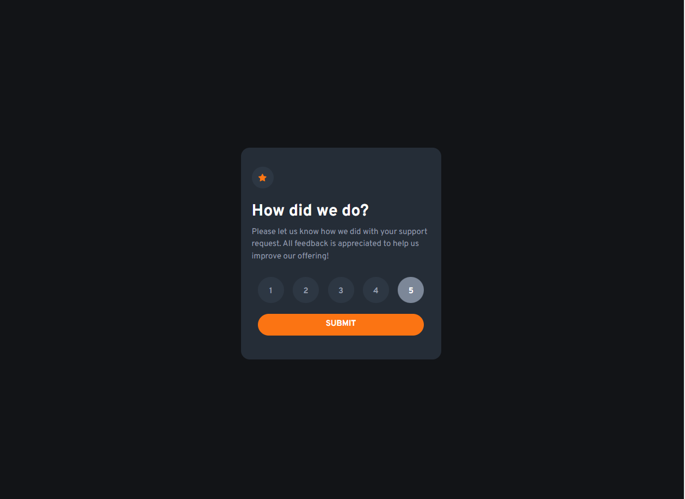

# Frontend Mentor - Interactive rating component solution

This is a solution to the [Interactive rating component challenge on Frontend Mentor](https://www.frontendmentor.io/challenges/interactive-rating-component-koxpeBUmI). Frontend Mentor challenges help you improve your coding skills by building realistic projects. 

## Table of contents

- [Overview](#overview)
  - [The challenge](#the-challenge)
  - [Screenshot](#screenshot)
  - [Links](#links)
- [My process](#my-process)
  - [Built with](#built-with)
  - [What I learned](#what-i-learned)
  - [Continued development](#continued-development)
  - [Useful resources](#useful-resources)
- [Author](#author)
- [Acknowledgments](#acknowledgments)

## Overview

### The challenge

Users should be able to:

- View the optimal layout for the app depending on their device's screen size
- See hover states for all interactive elements on the page
- Select and submit a number rating
- See the "Thank you" card state after submitting a rating

### Screenshots

### Links

- Solution URL: [https://sil3ntr.github.io/fem-interactive-rating-component/](https://www.frontendmentor.io/solutions/interactive-rating-component-learning-some-more-vanilla-js-4JYPRu3uTF)
- Live Site URL: [https://sil3ntr.github.io/fem-interactive-rating-component/](https://sil3ntr.github.io/fem-interactive-rating-component/)

## My process

### Built with

- Semantic HTML5 markup
- CSS custom properties
- Flexbox
- Mobile-first workflow
- Javascript 

### What I learned

I really have not done a lot of vanilla JS so it stretched me a little to learn some more about working with the DOM. I also learned a bit more about accessability, in this case using e.g a button for the rating selections rather than just a div because it comes with a level of accessability baked in.

### Continued development

I will need to run through this one again, tidy up my CSS, simplify and refine with the hope of reducing the amount of needed classes. I may repeat the same card using grid rather than flexbox for my layout.

### Useful resources

- [https://developer.mozilla.org/](https://developer.mozilla.org/) - I love MDN, such a great search reference when you come accross something you know little about. 
- [https://www.smashingmagazine.com/2021/03/complete-guide-accessible-front-end-components/#accessible-checkboxes-and-radio-buttons](https://www.smashingmagazine.com/2021/03/complete-guide-accessible-front-end-components/#accessible-checkboxes-and-radio-buttons) - Interesting info about accessability

- [https://dev.to/grahamthedev/5-star-rating-system-actually-accessible-no-js-no-wai-aria-3idl](https://dev.to/grahamthedev/5-star-rating-system-actually-accessible-no-js-no-wai-aria-3idl) - I read through this and found it helpful when looking at accessability for radio buttons for a rating system. Didn't use this solution but it was worth a read.

- [https://css-tricks.com/a-complete-guide-to-links-and-buttons/](https://css-tricks.com/a-complete-guide-to-links-and-buttons/) - Another great reference

- [https://stackoverflow.com/questions/61645055/is-there-a-way-to-pass-the-value-from-a-button-to-a-form-when-the-user-clicks-su](https://www.stackoverflow.com) - Good reference for working out how to pass the button value into the form submission.

## Author

- Github - [sil3ntr](https://github.com/sil3ntr/)
- Frontend Mentor - [@sil3ntr](https://www.frontendmentor.io/profile/yourusername)

